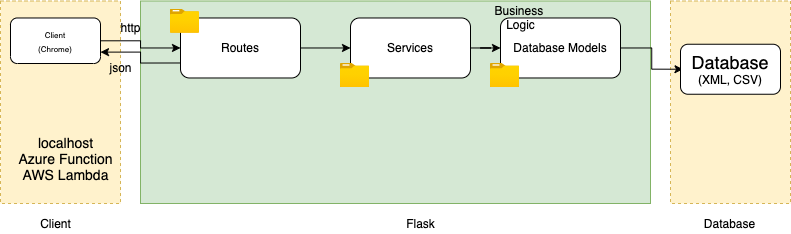

# ETL-Python

This repo contains Take-home Assignment for Tamanna Company.
In this little project, is to build an ETL (Extract, Transform, Load) to import products from multiple data sources.

## Description:
| Dataset Name   |           format              |description  |
|--------------------|-------------------------|---|
|Products from brand 1|`XML`           |Information about the products that brand 1 sells. For example, Shoes, T-Shirts, etc (Brand Product Data 1.xml)|
|Products from brand 2|`CSV`             |Information about the products that brand 2 sells. For example, Accessories like Jewelry, Bags, etc (Brand Product Data 2.csv)|

Each of these brands provides a snapshot of all active products readily available in their inventory as data files of different formats (CSV, XML, JSON, etc.). The project will support mainly two functions
- XML -> JSON
- CSV -> JSON
Using HTTP requests, JSON files shall be returned after ETL.

## Requirements
To install and run this repo you need:

-   Python 3.3+
-   Flask
-   virtualenv (not required if you are using Python 3.4)
-   git (only to clone this repository)

##  Install & Setup
-  Clone the project from Github

		git clone https://github.com/aghyad97/ETL-Python
- Enter the project folder
	 ```
	cd ETL-Python
	 ```

-  Install python dependencies

	```
	pip install -r requirements.txt
	```

  -   Create a virtualenv
	  ```
	  $ mkvirtualenv --python=$(which python3) ETL
	  ```
-   Deactivate the virtualenv,  
	```
	(etl)ETL-Python$ deactivate ETL;
	ETL-Python$ workon ETL
	```
-   Switch back to the virtualenv,  
	```
	(ETL)ETL-Python $
	```

## Architecture
- The figure below shows an overall architecture 
 

- The folder structure of the project is shown below:
	```
	ETL-Python
	│   .gitignore   
	|	.env
	│   README.md
	│	requirements.txt
	|	app.py
	|	config.py
	|	server.log
	|	
	└───templates
	│   │   index.html
	|	|	404.html
	|	
	└─── Models
	│   │   product.py
	│   
	└─── Data
	|	│   brand1.xml
	|   |	brand2.csv
	|   
	└─── utils
	    │   to_json.py
	```

##  Usage
To run flask server:
```
flask run
```
> `server.log` file keeps a log of all information, errors and warnings
## Deployment
To deploy the functions to the cloud (ex. **Azure Function**, **Amazon AWS Lambda**):
### Azure Function:
- Configure Azure service
- Create a resource group
- Create a web app (Choose Linux as OS, Runtime Stack is Python 3.7+)
- Create an App Service Plan
- Go to “Deployment center”, and select “Local Git”
- Select “Kudu” as the build server
- Now you will get Git Uri
- To deploy:
```
$ git remote add <app name> <Git Uri> (app name is ETL-Python)
$ git commit -a -m “first deploy”
$ git push ETL-Python master
```
- If nothing changed after refreshing the URL, you need to change the main module (which is app.py), so you need to change the startup file from the application settings, click save.
- Refresh the page now to see the changes
### Amazon AWS Lambda:
- You will need to setup AWS credentials with key id in your machine after creating the resources 
- Follow the steps below
```
$ pip install zappa
$ zappa init
$ zappa deploy
```

## Author
> Aghyad Alahmad

